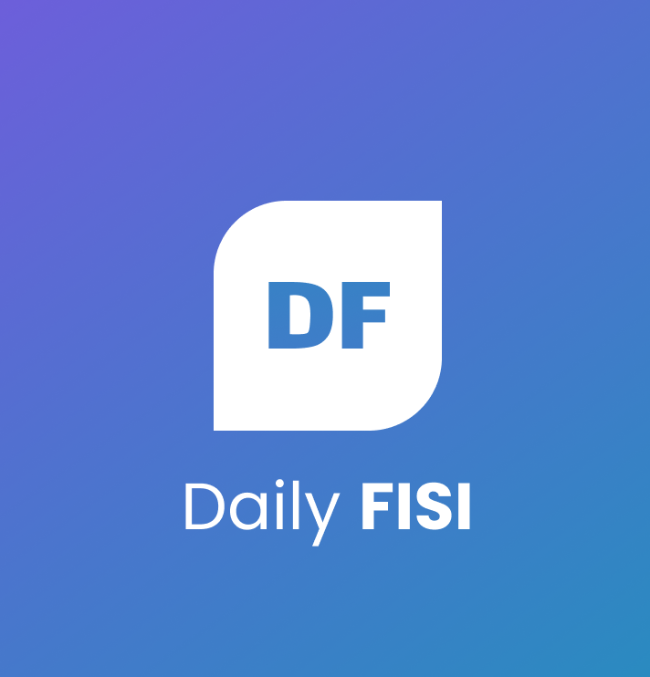

# MyDailyFisiApp

## Descripción
El proyecto de desarrollo tiene como objetivo fundamental la optimización de una tarea repetitiva y poco eficiente en la facultad de Ingeniería de Sistemas: la gestión de asistencias. Además, se enfoca en la publicación eficaz de eventos académicos. Su último propósito es proporcionar una solución práctica para encontrar rápidamente la ubicación de las aulas, permitiendo así una mejor gestión del tiempo en nuestra facultad. Este proyecto promete revolucionar la experiencia académica al simplificar procesos, aumentar la eficiencia y mejorar la conectividad en el entorno educativo de la facultad.
Para hacer el merge
## Funcionalidades

1. **Perfiles de Usuarios:**
   - Estudiantes, profesores y personal de la facultad pueden crear perfiles con información relevante, como nombre, foto, área de estudio, intereses académicos y de investigación.

2. **Muro de Noticias:**
   - Un espacio donde los usuarios pueden publicar actualizaciones, compartir artículos interesantes, proyectos en los que están trabajando, logros académicos y otra información relevante.

3. **Comunidades de Estudio:**
   - Sección donde los usuarios pueden plantear preguntas, discutir temas académicos, resolver dudas y debatir sobre tópicos relevantes.

4. **Eventos Académicos:**
   - Calendario que muestra conferencias, charlas, seminarios y otros eventos académicos que se llevarán a cabo en la facultad.
   - Los usuarios pueden confirmar su asistencia, recibir recordatorios y compartir información sobre los eventos.

5. **Comunicación a través de Chats:**
   - Función de mensajería interna que permite a los usuarios comunicarse directamente, ya sea uno a uno o en grupos.
   - Se utiliza para discutir proyectos, coordinar actividades y compartir información.

6. **Perfil de Profesor:**
   - Los profesores pueden destacar sus áreas de expertise, publicaciones académicas, horarios de consulta y recibir preguntas de los estudiantes.

## Tecnologías Utilizadas

- Kotlin
- Android Studio
- Bibliotecas de terceros

## Requisitos de Configuración

- Android Studio instalado
- SDK de Android versión X.X.X
- Otras dependencias o configuraciones específicas

## Instalación

1. Clona este repositorio: `git clone https://github.com/nabia1827/MyDailyFisiApp.git`
2. Abre el proyecto en Android Studio.
3. Configura las variables de entorno necesarias.

## Uso

Describe cómo se ejecuta o utiliza el proyecto:

1. Paso 1: ...
2. Paso 2: ...
3. ...

## Autor

* Jose Ambrosio
* Kevin Ortiz 
* Nabia Pachas
